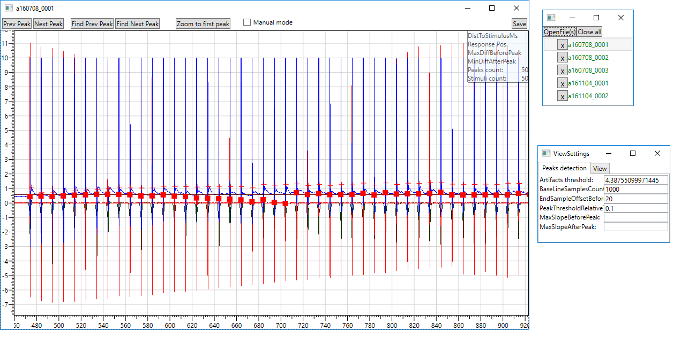
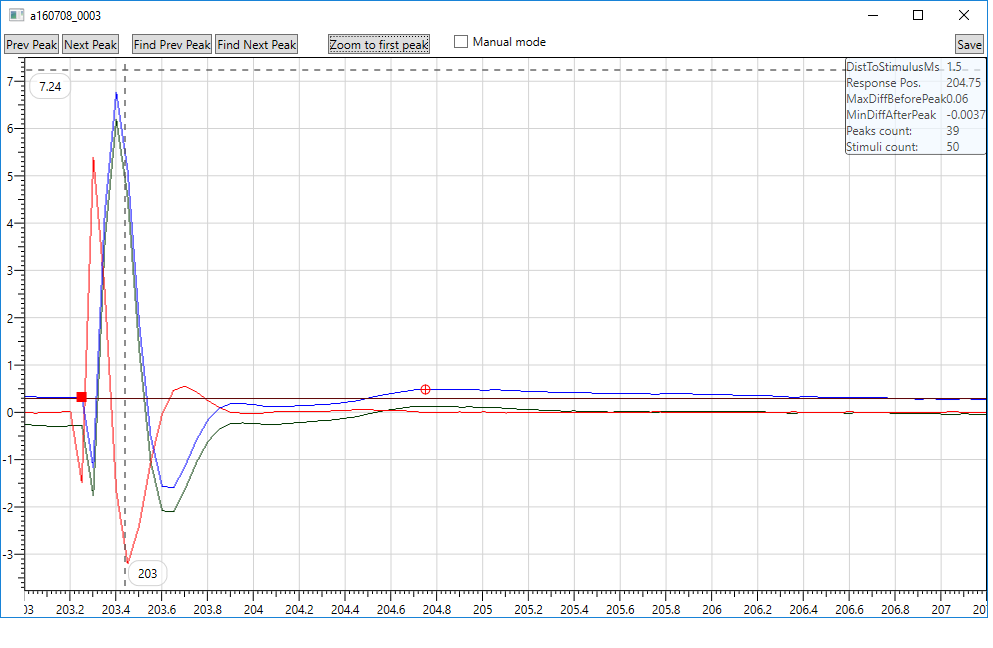

# PeaksProcessing2

This project was created as a part of the **GRANT GACR 14-28334S** to analyze patch-clamp recordings (latency of the first peak in inter-stimulus intervals). First we detected onset of stimulation artifacts in the recording by:

1.	High pass filtering of the recording by a linear phase Gaussian filter to remove low frequency components - sf (filtered signal).
2.	Robust estimation of noise using median absolute deviation (MAD). The noise variance then estimated as sigma = 1.4826 * MAD(recording).
3.	Artifacts peaks detection by thresholding sf and localizing maxima in the thresholded signal. The threshold is calculated as 0.5 * (max(sf) + 4 * sigma).

Then we detect start time of each stimulation as a corner of high curvature preceding the artifact peak. And finally we detected the first event of the inhibitory postsynaptic current (IPSC) response as the peak which amplitude is greater than the calculated threshold = mean of baseline + 2 * sigma + 0.1. The user can change both thresholds. He can also switch to the manual mode to correct detected events. When the user is happy with the analysis we calculate residual charge on the membrane generated by activation of postsynaptic ion channels and it is saved with IPSC latencies with other values to a file.

